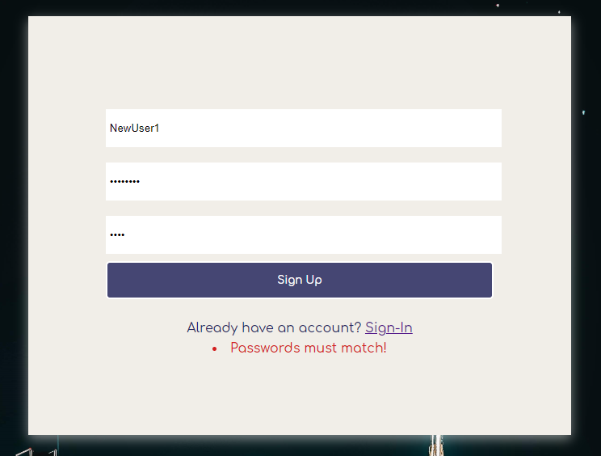

# Welcome to Sleuth

[Live Link](https://sleuth-jwe.herokuapp.com/#/)

## Table of contents:
 1. [Features](#features)
    - [User-authentication](#user-auth)
    - [Channel browsing](#channel-browsing)
    - [Live Messaging](#live-messaging)
    - [Live Thread Creation](#live-thread-creation)
    - [Workspace Search](#workspace-search)
 2. [Tech Stack](#tech-stack])
    - [Backend](#backend)
    - [Frontend](#frontend)
 3. [Known Bugs](#known-bugs)
 4. [Upcoming Features](#upcoming-features)

# Features

## User Auth

Sleuth uses a back-end user authentication model. Each user entry in the database holds a session_token which is used to set and match a randomly generated key stored inside the browsers session storage.

```ruby
# app/controllers/application_controller.rb

  # set the browsers session storage to log in user
  def login(user)
    user.reset_session_token
    session[:session_token] = user.session_token
  end

# app/models/user.rb

  # create a secure key as the session_token
  def reset_session_token
    self.session_token = SecureRandom.urlsafe_base64
    self.save!
    self.session_token
  end
```
 
To Log in and Sign up users, Sleuth uses a combination of backend and frontend error handling. Specifically, client side error handling is used to confirm requirements such as matching passwords, while the backend handles username uniqueness.

Errors rendered from the backend:

```ruby
# app/controllers/api/users_controller.rb
  def create
    @user = User.new(user_params)
    if @user.save
      login(@user)
      render 'api/users/show'
    else
      render json: @user.errors.full_messages, status: 401
    end
  end

```


Errors rendered from the frontend:
<br>


## Channel Browsing

## Live Messaging

## Live Thread Creation

## Workspace Search

# Tech Stack

## Backend

## Frontend

# Known Bugs

# Upcoming Features


