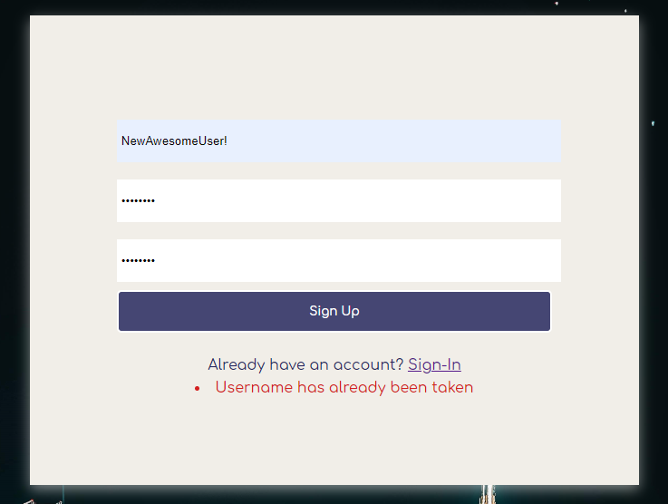

# Welcome to Sleuth

[Live Link](https://sleuth-jwe.herokuapp.com/#/)


## Intro

Sleuth is a web-app clone of the popular messaging app Slack, highlighting web-sockets technology and the ability to send and receive messages in real-time. This application was build for educational purposes as a part of App Academy's Software Engineering bootcamp.

Upon visiting the app, you will be greeted by a Channel Browser. Find public channels you would like to join using this tool. Use the search bar (top center) to search your workspace and use the left panel to navigate [threads](#note-on-threads).

Please read on for details on features, code-snippets, and pictures of Sleuth live in action!

## Table of contents:
 1. [Features](#features)
    - [User-authentication](#user-auth)
    - [Channel browsing](#channel-browsing)
    - [Live Messaging](#live-messaging)
    - [Live Thread Creation](#live-thread-creation)
    - [Workspace Search](#workspace-search)
 2. [Tech Stack](#tech-stack])
    - [Backend](#backend)
    - [Frontend](#frontend)
 3. [Known Bugs](#known-bugs)
 4. [Upcoming Features](#upcoming-features)

# Features

## User Auth

Sleuth uses a back-end user authentication model. Each user entry in the database holds a session_token which is used to set and match a randomly generated key stored inside the browsers session storage.

```ruby
# app/controllers/application_controller.rb

  # set the browsers session storage to log in user
  def login(user)
    user.reset_session_token
    session[:session_token] = user.session_token
  end

# app/models/user.rb

  # create a secure key as the session_token
  def reset_session_token
    self.session_token = SecureRandom.urlsafe_base64
    self.save!
    self.session_token
  end
```
 
To Log in and Sign up users, Sleuth uses a combination of backend and frontend error handling. Specifically, client side error handling is used to confirm requirements such as matching passwords, while the backend handles username uniqueness.

Errors rendered from the backend:

```ruby
# app/controllers/api/users_controller.rb
  def create
    @user = User.new(user_params)
    if @user.save
      login(@user)
      render 'api/users/show'
    else
      render json: @user.errors.full_messages, status: 401
    end
  end

```


Errors rendered from the frontend:

```javascript

// frontend/components/session_form/session_form.jsx

  handleSubmit(e){
    e.preventDefault();
    if (this.props.formType === "signup" && this.passwordsMatch() === false){
      this.setState({
        errors: ["Passwords must match!"]
      })
    } else {
      const user = {password: this.state.password, username: this.state.username}
      this.props.processForm(user);
    }
  }

 
```


## Channel Browsing

Freindly UX feature: Users are greeted with a channel browser which allows them to join and leave channels (functionality on hover). A relatively simple component to be used in conjunction with search and the left panel for navigation.


## Live Messaging

## Live Thread Creation

## Workspace Search

Users are able to use the search function to find Public Channels (which they do not already belong to), other users, and active [threads](#note-on-threads)*

As you can see in the image below, the search function has found a Public Channels match for "Chat" and provides the user the ability to join the channel immediately.


The `SearchBar` component renders a `SearchMatches` component for each category (`users`, `threads`, `publicChannels`) which receives a `type` prop and calls the appropriate function based on this prop:

```javascript
// frontend/components/search/search_matches.jsx

  function findMatches(){
    if (query.length < 1){
      return
    } else {
      switch(type){
        case "threads":
          return matchThreads()
        case "publicChannels":
          return matchPublicChannels()
        case "users":
          return matchUsers()
      }
    }
  }

```

Each of these functions uses a case insensitive Regular Expression to find matches (see `matchPublicChannels` below) and render a component for each match.

```javascript

// frontend/components/search/search_matches.jsx

  function matchPublicChannels(){
    let publicChannels = Object.values(entities)
    let  matchedPublicChannels = []
    for (let i = 0; i < publicChannels.length; i++){
      let regex = new RegExp(`${query}`, 'i')
      if (regex.test(publicChannels[i].title)){
        matchedPublicChannels.push(
          <PublicChannelSearchItem
            key={publicChannels[i].id}
            thread={publicChannels[i]}
            setSearchEntry={setSearchEntry}
            setDisplaySearch={setDisplaySearch}/>
        )
      }
    }
    return (
      matchedPublicChannels.length > 0 ? matchedPublicChannels :
      <div className="no-search-results">No Public Channels Found!</div>
    ) 
  }

```

Aside: although this project was originally built with Class based components, new additions have utilized React Hooks. See the `UserSearchItem` below which is rendered by `matchUsers` (equivalent to `matchPublicChannels` above, except for `users`)

```javascript

// frontend/components/search/user_search_item.jsx

  imports...

  export default ({user, setSearchEntry, setDisplaySearch}) =>{

    const history = useHistory()
    const threads = useSelector(state => Object.values(state.workspace.threads))
    const currentUserId = useSelector(state => state.session.id)
    const dispatch = useDispatch()
    let activeThread = false

    for (let i = 0; i < threads.length; i++){
      if(threads[i].users.length === 2 && threads[i].users.includes(user.id)){
        activeThread = threads[i].id
        break
      }
    }

    function handleClick(){
      setDisplaySearch(false)
      setSearchEntry("")
    }

    function createDirectMessage(){
      let newDirectMessage = { 
        channel: false,
        private: true,
        creator_id: currentUserId,
        title: "placeholder",
      }
      dispatch(createThread(newDirectMessage, [currentUserId, user.id]))
        .then(action => history.push(`/client/${action.threadId}`))
      setDisplaySearch(false)
      setSearchEntry("")
    }

    return(
      activeThread ? 
      <div className="search-user">
        <Link onClick={handleClick} to={`${activeThread}`}>{user.username}</Link>
        <Link onClick={handleClick} to={`${activeThread}`}>Chat</Link>
      </div> :
      <div className="search-user">
        <a onClick={createDirectMessage}>{user.username}</a>
        <a onClick={createDirectMessage}>Chat</a>
      </div>

    )
  }


```

# Tech Stack

## Backend

## Frontend

# Known Bugs

# Upcoming Features

### *note on threads*
In reviewing this code base you will see the terms `thread`, `channel`/`publicChannel`, `directMessage` and `channel_dm` in numerous places and seemingly used interchangeably. But, it is important to disambiguate each of these terms. `channel_dm` refers to the backend storage of any frontend `thread`. `channel` refers to any publicly available "chat room" whereas `directMessage` refers to any "chat room" between a specified group of users that cannot be found or joined by others. There are instances where the distinction between `publicChannel` and `directMessage` is meaninginless, and in these cases `thread` is used. e.g. `ThreadIndex`. To further clarify, an initial design decision was made such that although there is a distinction between `directMessages` and `channels` on the front end, they are stored within the same `channel_dm` table in the backend.
